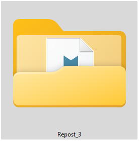
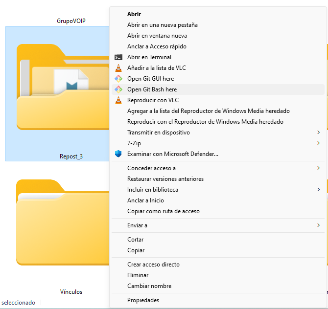
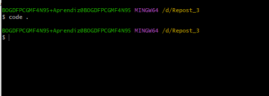
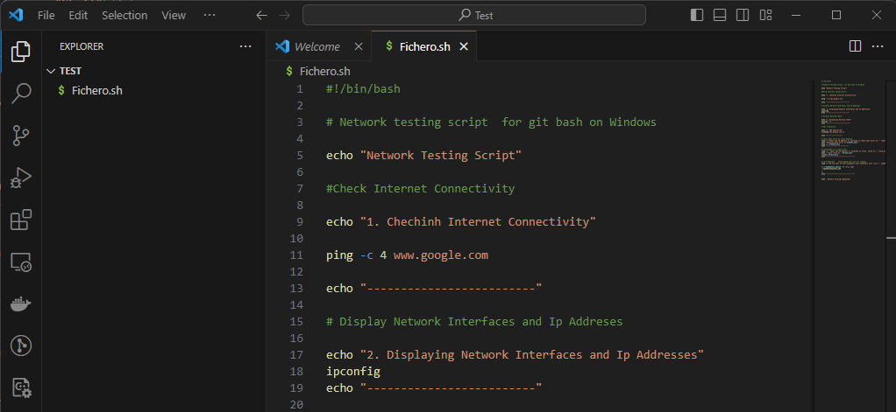

<a name="readme-top"></a>


<div align="center">


<br/>
<h3><b>Proyecto de documentación</b>

</div>

# ✅ TABLE OF CONTENTS
- [📖 Proyecto de documentación](#Proyecto)
[🫏 Getting Started](#getting-started)
  - [🐧 Fuente](#Creación-de-codigo)
    - [Paquete de tecnologia](#tech-stack)
    - [shell](#shell)
  - [🚀 Live Demo](#live-demo)
 - [💻 Getting Started](#getting-started)
   - [Setup](#setup)
   -  [Prerequisites](#prerequisites)
   - [Install](#install)
   - [Usage](#usage)
   - [Run tests](#run-tests)
   - [Deployment](#deployment)
- [👥 Authors](#authors)
- [🕹️ Future Features](#future-features)
- [🤝 Contributing](#contributing)
- [⭐ Show your Support](#support)
- [👏 Acknowledgements ](#ackknowledgements)
- [❓ FAQ ](#faq)
- [📃 License](#license)

# 📖 [Proyecto de documentación]<a name="Proyecto"></a>

**[Proyecto de documentación]** Es una documentación para explicar el uso de comandos de GIT BASH y SHELL

## 🐧 Fuente <a name="Creación-de-codigo"></a>

<p>
Este proyecto utilizo como fuente los siguientes lenguajes:
HTML, MARKDOWN AND SHELLSCRIPT, GIT, GITHUB
</p>

### Paquete de tecnologia <a name="tech-stack"></a>

<li> HTML </li>
<li> MARKDOWN </li>
<li> SHELLSCRIPT </li>
<li> GIT </li>
<li> GITHUB </li>

<details>
<summary> Client </summary>
    <ul>
    <li><a href="https://developer.mozilla.org/es/docs/Web/HTML">HTML</a></li>    
    </ul>
</details>

<details>
<summary>Markdown</summary>
<ul>
<li><a href="https://markdown.es/sintaxis-markdown/">Markdown</a></li>
</ul>
</details>


### Shell <a name="Shell"></a>
<li> test de conectividad <li>
<li> configuración de red <li>
<li> enrutamiento <li>
<li> resolución de dns <li>
<li> revisar puertos de host <li>
<li> prueba de velocidad <li>


<p align="right"><a href="#readme-top">Back to top</a></p>

### [Documentación]<a name="Pasos"></a>
Paso a paso de la documentación
🌺​ Primer paso

    | Crear una carpeta con el nombre del repositorio


    | Ejecutar la carpeta con GIT BASH


    | Para iniciar la ejecución con Visual Studio utilizamos code . que nos permite abrir el directorio 


    | En visual studio se creara un fichero.sh para ejecutar el analisis de la red 


## 💻 Getting Started <a name="getting-started"></a>


To get a local copy up and running follow these steps:

### Prerequsites 

To run this project you need the following tools:

- [VS Code]
- [Git and GitHub]
- [ShellScript ]

### Setup

Clone this respository  to your desired folder:

```sh
cd NEWTORK-SCRIPT
git clone https://github.com/alyconr/Network-Shell-Script-.git
```
### Install

Install This project with:

```sh
    ./networkScript.sh
```

### Usage 

To run the project, execute the following command:

```sh
./networkScript.sh
```

### Run Test

To run test, run the following command or endpoint:

```sh
python -m unittest test_module.TestClass
```


### Deployment

Deploy using your local enviroment

<p align="right"><a href="#readme-top">Back to top</a></p>

## 👥 Authors <a name="authors"></a>

Jeysson Contreras

🧑🏻‍💻 **Author 1**

 - GitHub: [@alyconr](https://github.com/alyconr)
 - LinkedIn: [LinkedIn](https://www.linkedin.com/in/jeysson-aly-contreras)


## 🕹️ Future Features <a name="future-features"></a>

- [ ] **[Ping]**
- [ ] **[Nslookup]**
- [ ] **[BandWitdth Test]**


## 🤝 Contributing <a name="contributing"></a>


Contributions, issues, and  feature requests are welcome!

Feel free tp check the [issues page](https://github.com/alyconr/Network-Shell-Script-/issues)


## ⭐ Show your Support

Wrrite a message to encourage readers to support your project

If you like this project please give one start

## 👏 Acknowledgements <a name="acknowledgements"></a>

I would like to thank my learning teammates  and Sena Instructor

## 📃 License <a name="license"></a>

This Project is [MIT](./LICENSE.md) licensed

<p align="right"><a href="#readme-top">Back to top</a></p>


